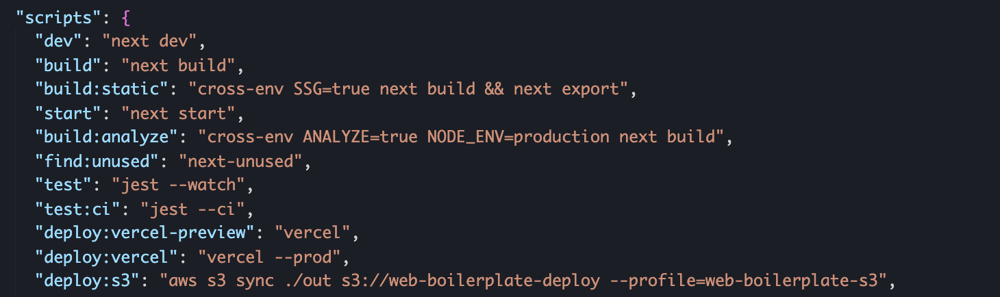

# **Nextjs AWS S3, CloudFront 에 배포**

AWS에서 정적 사이트 S3/CloudFront에 배포하는 방법을 설명한다.

## **IAM 에서 권한 설정 및 CLI 설정**

<hr />

먼저 aws에 배포하기전에 프로젝트를 빌드해줘야한다. 이때 SSG, CSR 상태의 빌드 결과물이 나와야한다.

```bash
// next default build
yarn build

// SSG next export 를 하기위해서 사용
yarn build:static
```

이렇게 빌드된 프로젝트를 먼저 S3에 배포를 해야한다. S3에 프로젝트 배포를 하기전에 AWS에 권한을 설정해야한다.


먼저 사용자를 추가해준다.


사용자 이름을 원하는 이름으로 설정하고 하단의 프로그래밍 방식 액세스를 체크해주세요.


그리고 기존 정책 직접 연결을 선택 후 S3 를 검색해서 AmazonS3FullAccess 를 체크. 해당 권한은 S3 의 모든 사용권한을 부여해줍니다. 그리고 다음을 넘어가면 태그를 추가 할 수 있는데 해당 태그는 생략 및 추가해도 된다.


태그 설정까지 끝나면 밑에 사진과 같은 결과가 다음으로 넘어가고, 사용자 만들기를 누르면 다음과 같이 액세스키가 만들어집니다.


여기서 .csv 다운로드 를 누르셔서 아주 안전한 곳에다가 저장해주세요.

## **AWS CLI 설치**

<hr />

그 다음엔 AWS CLI 를 설치하세요. 이 도구를 설치하면 명령어를 통하여 AWS 관련 작업을 처리 할 수 있게 됩니다. 설치 방법은 [AWS Command Interface](https://docs.aws.amazon.com/ko_kr/cli/latest/userguide/cli-chap-install.html) 설치 매뉴얼을 참고하시길 바랍니다. 운영체제마다 방식이 다르니 좌측에서 여러분이 사용하는 운영체제를 선택해서 진행해주세요.

설치가 완료되면

```bash
$ aws configure --profile web-boilerplate-s3
AWS Access Key ID [None]: 액세스키
AWS Secret Access Key [None]: 비밀키
Default region name [None]: ap-northeast-2
Default output format [None]: json
```

이제 CLI 관련 설정은 모두 다 되었습니다!

## **AWS S3 설정**

<hr />
<br />


버킷 만들기 버튼을 누르세요. 그러면 버킷을 생성하는 화면이 노출이 되는데 해당 화면에서 버킷 이름을 설정해줍니다.


그리고 버킷을 만들고 나서 생성된 S3 를 목록에서 클릭하면 다음과 같은 화면이 나타납니다.


우리가 만든 S3 버킷에 익명 사용자들이 파일들을 조회 할 수 있도록 권한을 설정해주겠습니다. [참고 링크](https://docs.aws.amazon.com/ko_kr/AmazonS3/latest/userguide/example-bucket-policies.html)


버킷 정책에서 편집 버튼을 통해서 버킷의 정책 수정이 가능한데 해당 기능을 먼저 수행하기전에 퍼블릭 액세스 설정을 변경해야합니다.


이렇개 변경이 완료되었으면 다시 버킷 정책을 수정하는데 해당 내용처럼 등록을 해주시면 됩니다.

```json
{
  "Version": "2012-10-17",
  "Statement": [
    {
      "Sid": "AddPerm",
      "Effect": "Allow",
      "Principal": "*",
      "Action": ["s3:GetObject"],
      "Resource": ["arn:aws:s3:::버킷 이름/*"]
    }
  ]
}
```

그 다음에는 속성 탭에 들어가서 정적 웹 사이트 호스팅을 누르세요. 인덱스 문서와 오류 문서는 index.html 으로 입력하고 저장을 하세요. 그리고, 이 화면에서 엔드 포인트 주소가 나타나는데, 우리가 S3 에 파일들을 올리면 이 링크로 조회 할 수 있게됩니다.


## **배포하기**

<hr />
<br />

이제 AWS CLI를 통해서 배포를 할려면 해당 명령어를 작성하면 됩니다.

```bash
$ aws s3 sync ./out s3://web-boilerplate-deploy --profile=web-boilerplate-s3
```

배포할때마다 이 명령어를 입력하기는 번거로우니까 다음과 같이 package.json 에 스크립트로 추가해두면 편합니다.



## **CloudFront 설정하기**

<hr />
<br />

추가적으로 CloudFront 를 사용하여 S3 의 파일들을 CDN 에 태워줌으로서, 다음 장점들을 챙길 수 있습니다.

- S3에 커스텀 도메인 + HTTPS 지원
- CDN 을 통한 더 빠른 페이지 응답속도

CloudFront 페이지에 들어가서 Create Distribution 버튼을 만드세요.


그리고, Web 쪽의 Get Started 를 누르세요


Origin Domain Name 쪽을 선택하시면 우리가 만들었던 S3 버킷 정적 호스팅 주소가 보일것입니다. 해당 이름을 누르시고, 그리고 하단 쪽 Viewer Protocol Policy 에서는 Redirect HTTP to HTTPS 를 선택하세요. 그리고 쭉 내려서 Create Distribution 을 누르세요.


그러면 이렇게, In Progress 라고 뜨는 항목이 보일 것입니다. 보통 약 15분 ~ 30분 걸려야 CloudFront 생성이 완료 됩니다. 저기에 보이는 d1df94nostedwa.cloudfront.net 형식의 주소가 CDN 이 적용된 주소입니다.


배포가 완료되고 사이트 주소로 들어가면 접속을 할 수 없을텐데 해당 오류는

Cloud-Front General → Default Root Object → Add "index.html"

위에 순서로대로 해주면 해결이 된다.

## **캐시 Purge 하기**

<hr />
<br />

CDN 을 사용한다면, 만약에 프로젝트에 업데이트가 발생했을 때 기존에 CDN 에 퍼져있는 파일들을 새로고침 해주어야 합니다. 해당 작업을 처리하기 위해선 Purge, 혹은 Invaldiation 이라는 작업을 해주어야 합니다. CDN 에 퍼져있는 파일을 제거처리함으로서 새로 받아오게끔 하는것이죠.

이를 하려면 우선 우리가 이전에 만들었던 계정에 CloudFrontFullAccess 라는 권한도 추가해주어야 합니다. IAM 에서 우리가 만들었던 계정에 다음과 같이 권한을 추가하세요.


이제, AWS CLI 로 해당 CloudFront 의 앱 정보를 날려주려면 다음 명령어를 사용하면 됩니다.

```
$ aws cloudfront create-invalidation --profile=web-boilerplate-s3 --distribution-id E12IRMA1L80372 --paths /*
```

distribution-id 는 CloudFront 에서 보여지는 ID 값을 넣어주면됩니다.

```json
  "scripts": {
    "dev": "next dev",
    "build": "next build",
    "build:static": "cross-env SSG=true next build && next export",
    "start": "next start",
    "build:analyze": "cross-env ANALYZE=true NODE_ENV=production next build",
    "find:unused": "next-unused",
    "test": "jest --watch",
    "test:ci": "jest --ci",
    "deploy:vercel-preview": "vercel",
    "deploy:vercel": "vercel --prod",
    "deploy:s3": "aws s3 sync ./out s3://web-boilerplate-deploy --profile=web-boilerplate-s3",
    "cdn:pure": "aws cloudfront create-invalidation --profile=web-boilerplate-s3 --distribution-id E12IRMA1L80372 --paths /*"
  },
```

이제 프로젝트 빌드 후 배포 할 때 이렇게 하시면 됩니다.

<br />
<hr />

## **참고자료**

[AWS CLI Error](https://github.com/aws/aws-cli/issues/1778) Unable to parse config file error
