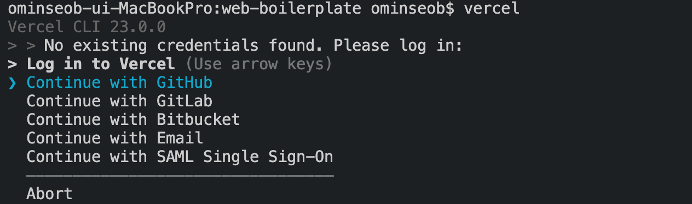

# **Vercel CLI Deploy**

Vercel로 배포하는 방법에는 여러 가지가 있다.

- **Vercel for Git**
- **Deploy Hooks**
- **Vercel CLI**
- **Vercel API**

배포 할 때 프로젝트는 빌드 단계를 사용하여 업로드되고 프로덕션 준비된 출력으로 변환됩니다. 빌드 단계가 성공적으로 완료되면 미리보기 URL에서 변경 불가능한 새 배포를 사용할 수 있습니다.

여기 문서에서는 Vercel CLI를 통해서 배포 과정을 진행 할 예정이다

<br />

# **배포 과정**

Vercel CLI를 사용하면 터미널에서 단일 명령으로 프로젝트를 배포 할 수 있다.

Vercel로 배포하기전에 vercel 패키지를 글로벌 형태로 설치해야한다.

```bash
// npm
npm i -g vercel

// yarn
yarn global add vercel
```

<br />

## **1. Vercel Login**

먼저 vercel cli를 다운로드 후 현재 프로젝트가 등록된 계정에 로그인을 한다.



여기서는 github로 로그인을 했다.


여기서 로그인이 완료되면 vercel 홈페이지에서 cli로 로그인을 했다는 내용이 노출이 된다.


## **2. Vercel Preview And Prod Deployment**

vercel 배포하기 위해서는

```bash
// preview
vercel

// production
vercel --prod
```

해당 명령어를 통해서 배포를 진행한다.

최초 배포 과정은 이렇습니다.


그리고 vercel 대시보드에서 확인하면 배포가 성공적으로 완료된다

### Preview

<hr />

미리보기 배포는 모든 배포의 기본값입니다.

분기로 푸시하거나 vercel 명령을 사용하여 배포 할 때마다 이것은 미리보기 배포입니다.

미리보기 배포를 수행하면 최신 배포의 URL을 반영하도록 미리보기 URL이 업데이트됩니다.

미리보기 URL은 Git을 사용할 때 가져 오기 또는 병합 요청에 제공되며 프로젝트가 속한 사용자 또는 팀의 이름을 포함합니다.

미리보기 URL을 요청하면 X-Robots-Tag HTTP 헤더가 noindex로 설정됩니다. 이렇게하면 미리보기 URL이 Google과 같은 검색 엔진에 의해 색인 생성되지 않습니다. 이 동작에 대한 유일한 예외는 사용자 지정 도메인이 미리보기 분기에 할당 된 경우입니다. 미리보기 배포에 할당 된 맞춤 도메인은 값이 noindex 인 X-Robots-Tag 헤더를 설정하지 않습니다.

### Production

<hr />

프로덕션 배포는 두 가지 다른 상황에서 이루어집니다. Production Branch (일반적으로 main)에 병합하거나 vercel --prod 명령을 사용하여 배포 할 때마다 이것이 프로덕션 배포입니다.

프로덕션 배포를 수행하면 프로덕션 도메인이 최신 배포의 도메인을 반영하도록 업데이트됩니다.

프로덕션 도메인은 Vercel 대시 보드에있는 프로젝트의 도메인 탭에서 정의됩니다.

### 참고자료

<hr />

- [vercel-deployment](https://vercel.com/docs/platform/deployments)

- [vercel-cli](https://vercel.com/docs/cli)

### 주위사항

이 프로젝트에서는 vercel cli를 통해서 배포를 사용하는 사용하는 이유는
github 연동을 통해서 배포를 한 경우 푸시 및 머지를 통해서 자동 배포가 되기 때문에 cli를 통해서 배포를 진행한다.
